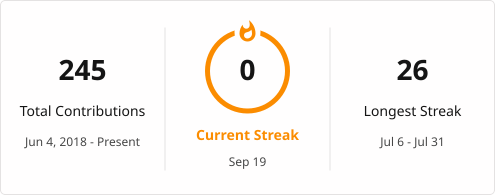

<h1 align="left">Hi, I'm Farhad Monavar 👋</h1>

## 🐍 Python Backend Developer | 📊 Data Analyst | 📈 Financial Data Enthusiast

I build scalable backend systems, analyze complex datasets, and turn raw data into insight. My work sits at the intersection of **software engineering, data analysis, machine learning, and financial markets** — I enjoy developing intelligent, data-driven solutions and exploring how data can help explain and predict real-world outcomes.

---

### 🚀 About Me
- 🔭 Currently building **Python backend systems and data-driven applications**
- 🌱 Continuously learning **Machine Learning, Data Mining, and Financial Analytics**
- 📊 Passionate about extracting knowledge and hidden patterns from data
- 💹 Interested in **financial markets, quantitative analysis, and algorithmic trading**
- 🧠 Enjoy solving problems through programming, statistics, and data science
- ⚡ I believe data isn't just information — it's a foundation for knowledge and decision-making
- 📫 Reach me at **farhad.monavar@gmail.com**

---

### 🛠️ Languages & Tools

  
  

---

### 📌 Latest Projects
<!--START_SECTION:projects-->
- **[farhadmonavar](https://github.com/farhadmonavar/farhadmonavar)** `JavaScript`
- **[data-engineering-pipeline](https://github.com/farhadmonavar/data-engineering-pipeline)**
- **[stock-prediction-portal](https://github.com/farhadmonavar/stock-prediction-portal)** `Jupyter Notebook`
- **[neural-network-EA](https://github.com/farhadmonavar/neural-network-EA)** `MQL5`
- **[advanced-django-ecommerce](https://github.com/farhadmonavar/advanced-django-ecommerce)** `JavaScript`
- **[django-blog-application](https://github.com/farhadmonavar/django-blog-application)** `Python`
<!--END_SECTION:projects-->

---

### 📊 GitHub Stats

  

  

